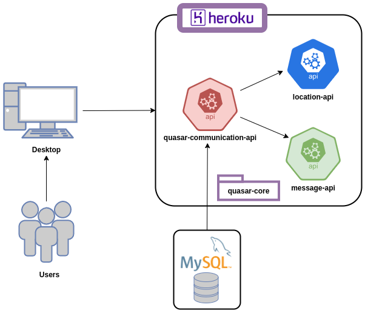
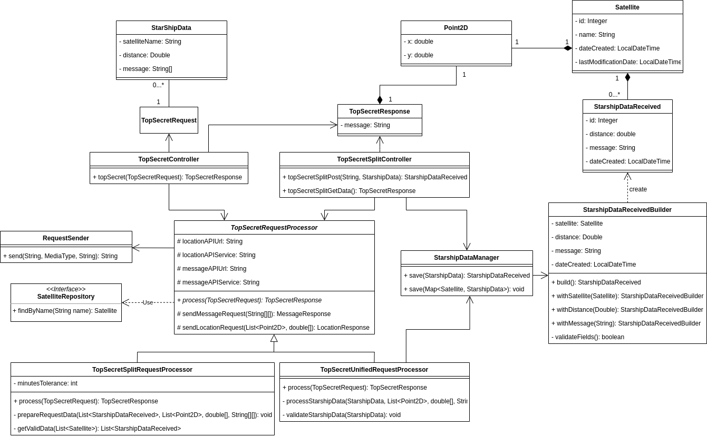
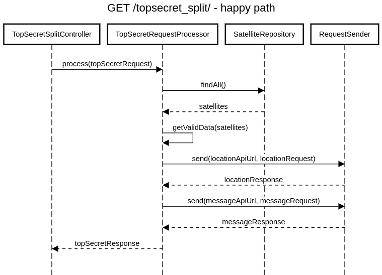

# DESAFIO TÉCNICO - MELI
## Operación de fuego quasar

## quasar-comunication-api

## Objetivo
Esta API tiene como fin brindar el servicio para obtener la posición y el mensaje que emite una nave estelar. 

## Especificación

### Tecnologías
Las tecnologías que se utilizaron son:
- Java 1.8
- Maven
- SpringBoot
- Hibernate
- MySQL
- JPA
- Log4j2

### Descripción de los servicios
La API se encuentra hosteada en **heroku**, que es un servicio de hosting que brinda opciones para hostear APIs de manera gratuita. Para más información puede ingresar a www.heroku.com.

La API expone dos servicios:
- topsecret **URL https://salva-quasar-communication-api.herokuapp.com/topsecret**
- topsecret_split **URL https://salva-quasar-communication-api.herokuapp.com/topsecret_split/{satellite_name}**

#### Servicio *topsecret*
Este servicio acepta llamadas **POST**, siendo la estructura del body:
```JSON
{
  "satellites": [
    {
      "name": "kenovi",
      "distance": 250,
      "message": [ "este", "", "", "mensaje", "" ]
    },
    {
      "name": "skywalker",
      "distance": 400,
      "message": [ " ", "", "es", "", "", "secreto" ]
    },
    {
      "name": "sato",
      "distance": 632.455532,
      "message": [ "este", "", "un", "", "" ]
    }
  ]
}
```

El response es con un código 200 (**OK**), y la estructura del body es:
```JSON
{
  "position": {
    "x": -100,
    "y": 75.5
  },
  "message": "este es un mensaje secreto"
}
```
En caso de no poderse determinar la posición o el mensaje que emite la nave, se retorna un response con mensaje de error y código 404 (**NOT_FOUND**).

#### Servicio *topsecret_split*

Este servicio acepta llamadas **GET** y **POST**.

En el caso de la llamada **POST** se debe incluir como variable en la ruta el nombre del satélite (*satellite_name*).
Al recibir un POST, la API persiste la información emitida de la nave estelar hacia el satélite en cuestión.

Un ejemplo de una llamada **POST**:

**POST https://salva-quasar-communication-api.herokuapp.com/topsecret_split/kenovi**

```JSON
{
    "distance": 175,
    "message": [ "este", " ", "un", " ", "secreto" ]
}
```
Y el response tiene un codigo 201 (**CREATED**) una estructura:

```JSON
{
    "id": 38,
    "distance": 175.0,
    "message": ["este"," ","un"," ","secreto"],
    "dateCreated": "2021-01-20T22:05:43.345"
}
```
En el caso de una llamada **GET**, la API procede a retornar la posición y el mensaje que emite la nave. 
Esta llamada no tiene body, y la respuesta tiene el código 200 (**OK**) y la estructura del body:
```JSON
{
  "position": {
    "x": -100,
    "y": 75.5
  },
  "message": "este es un mensaje secreto"
}
```

Para poder obtener esta información, la API busca la última emisión de la nave estelar a cada satelite para poder tener las entradas necesarias. 
Ahora bien, una emisión con una antigüedad mayor de 60 minutos (configurable) no es considerada válida.

## Diagramas

### Diagrama de Arquitectura


### Diagrama de Clases


### Diagramas de Secuencia
### Llamada POST /topsecret - flujo normal


### Llamada POST /topsecret_split/{satellite_name} - flujo normal


### Llamada GET /topsecret_split - flujo normal


**Nota: Los archivos README.md de las otras APIs (location-api y message-api) tienen su propia especificación.**

## Testing
Para realizar el testing de las APIs se realizaron test unitarios con Junit y test de integración utilizando herramientas proveidas por SpringBoot.
Los objetivos para llevar un buen control y seguimiento del código y, de esta forma, poder mantener un nivel de calidad satisfactorio, son:
- Coverage mayor al 80%.
- Cantidad de bugs: 0.
- Cantidad de code smells: menor a 5.
- Repetición de código: 0%.
- Vulnerabilidades: 0.

Con estas métricas, se analizó cada API utilizando Sonarqube con los resultados:

### Reporte Sonarqube: quasar-communication-api


### Reporte Sonarqube: location-api


### Reporte Sonarqube: message-api


Con los resultados anteriores, podemos determinar una coverage promedio de 90.3%.

## Ejemplos para probar la API
Una de las herramientas más famosas para probar a alto nivel de manera fácil y rápida es Postman.

*Nota: Quizas la primer request que se realice a cada API falle por timeout. ¿Por qué sucede esto? Se debe al servicio de hosting gratuito de heroku, este controla las APIs y cuando una pasa a estar inactiva por, aproximadamente, 5 minutos, pasa esa API a un estado "asleep" (dormida). Esto provoca que, cuando una API que se encuentra en ese estado reciba un request, heroku cambia el estado de la misma a "Active". Este cambio de estado conlleva el levantar todo el contexto de la API, lo que lleva un tiempo significativo.*

### Ejemplo de llamada a quasar-communication-api

En el siguiente ejemplo podemos ver como seteamos el body de la llamada POST hacia la URL que expone la quasar-communication-api:


A continuación vemos el resultado de la ejecución:


## Conclusión
A modo de cierre, me gustaría compartir que cosas hubiese agregado o hecho de otra forma, pero que por cuestiones de tiempo, quedan para la próxima versión:
- Agregar seguridad a las APIs (Una herramienta candidata para utilizar es SpringSecurity).
- Realizar el log no solo hacia la consola del servidor (que no es muy práctico) sino también agregar un logger que tenga como target una tabla en la BD (hecho que no se realizó por las limitaciones del servicio de hosting gratuito).
- Investigar sobre Lombok (https://projectlombok.org/), al parecer es una herramienta que podría servir de mucho.
- Mejorar la parametrización: para parametrizar las APIs se utiliza un archivo .properties en cada una. Sería mejor tener una, o más, tabla/s para poder parametrizar cada API de mejor manera.
- Agregar testing de estres (quizás usando Artillery)
- Agregar CI (idealmente utilizando una imagen Docker)
- Por último, y no por eso menos importante, realizar pruebas de aceptación con... ¡Han Solo!

#### Autor: Ricardo Nicolás Salva.

